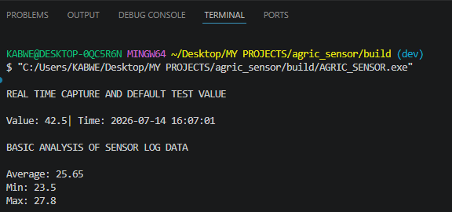
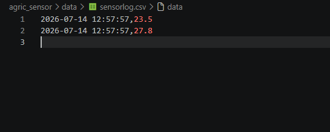

## Smart Agricultural Sensor Logger

## Overview
This project is a modular C++ application that simulates agricultural sensor data logging.  
It demonstrates professional software engineering practices using **CMake**, **Git branching workflow**, and **GitHub documentation**.

The system captures sensor readings with precise timestamps (`std::chrono`), stores them in a log, and provides basic analysis (average, min, max).  
Data can be exported to CSV files for further processing or integration with IoT systems.

---

## Features
- **SensorReading** class  
  - Encapsulates a sensor value and timestamp  
  - Provides formatted string output and stream operator overloads  

- **SensorLog** class  
  - Stores multiple readings in a `std::vector`  
  - Supports adding readings, computing average, min, and max  
  - Exports readings to CSV files  

- **Main driver (`main.cpp`)**  
  - Demonstrates usage of `SensorReading` and `SensorLog`  
  - Provides a simple test harness for logging and analysis  

---

## Program Demo

The following examples demonstrate the SmartAgriSensorLogger application in action.

### Console Output


 - Sensor values that are captured in program are not displayed in console they are directly
 written to sensor_log.csv

The image below illustrate test values only, not what is sent to CSV,and all calculations are 
done from sensor readings in CSV(not in console).


<p align="center">
  
</p>


### Generated CSV File

- The application exports sensor readings into a CSV file that can be opened in Microsoft Excel, LibreOffice Calc, or other spreadsheet software.

<p align="center">
  
</p>

---

## Roadmap
- [x] Initialize Git repository and `main` branch  
- [x] Create `dev` branch for integration  
- [x] Create `feature/sensorlog` branch for isolated development  
- [x] Implement `SensorReading` class (value + timestamp, getters, operator<<)  
- [x] Update `CMakeLists.txt` to include new modules  
- [x] Implement `SensorLog` class (vector of readings, analysis methods)  
- [x] Extend `main.cpp` to test `SensorLog` (average, min, max, CSV export)  
- [x] Create `data/` folder and configure `.gitignore` for generated CSV files  
- [x] Document usage examples in README  
- [ ] Add automated tests (Catch2 or GoogleTest)  
- [ ] Extend system with multiple sensor types (temperature, humidity, soil moisture)  
- [ ] Integrate with microcontrollers for real sensor input  

---

## Requirements

To build and run this project, you need:

- **C++ Compiler**
  - GCC 9.0+ or Clang 10.0+ (Linux/macOS)
  - MSVC 2019+ (Windows)
- **CMake** 3.15 or higher (for cross‑platform build configuration)
- **Git** (for version control and branching workflow)
- **VS Code** or another IDE/text editor (recommended for development)
- **Standard C++ Libraries**
  - `<chrono>` for timestamps
  - `<vector>` for storing sensor readings
  - `<fstream>` for file I/O
  - `<limits>` and `<stdexcept>` for safe error handling
- **Operating System**
  - Windows, Linux, or macOS (tested on Windows with MinGW64)

Optional (for future extensions):
- **Catch2 or GoogleTest** (for automated testing)
- **Arduino/ESP32 toolchain** (for real sensor integration)
- **Python or R** (for data visualization of CSV logs)

---

## Project Structure
- include/ → Header files (SensorReading.h, SensorLog.h)
- src/ → Source files (SensorReading.cpp, SensorLog.cpp)
- data/ → Generated CSV logs (ignored by Git)
- build/ → Build output (CMake-generated)
- CMakeLists.txt → Build configuration
- README.md → Documentation
- main.cpp → Test driver

---

## Build Instructions
```bash
mkdir build && cd build
cmake ..
make
./AGRIC_SENSOR

```

---

## Usage Example
```cpp
SensorLog log;
log.addReading(SensorReading(23.5, std::chrono::system_clock::now()));
log.addReading(SensorReading(27.8, std::chrono::system_clock::now()));

std::cout << "Average: " << log.computeAverage() << std::endl;
std::cout << "Min: " << log.findMin() << std::endl;
std::cout << "Max: " << log.findMax() << std::endl;

log.saveToFile("data/sensorlog.csv");
```

---

## Professional Workflow
- **Branches**
  - `main` → stable, production-ready code
  - `dev` → integration branch for active development
  - `feature/*` → isolated feature branches (e.g., `feature/sensorlog`)

- **Commit discipline**
  - Atomic commits with clear messages
  - Build system changes (CMake) are committed alongside code changes
  - Generated data (`data/*.csv`) excluded via `.gitignore`

---

## Future Extensions
- Add support for multiple sensor types (temperature, humidity, soil moisture)
- Implement automated testing framework (Catch2 or GoogleTest)
- Integrate with microcontrollers (Arduino, ESP32) for real sensor input
- Extend CSV export to JSON or database storage
- Add visualization tools (graphs, charts) for sensor data
- Introduce configuration files for flexible logging options
- Explore IoT integration with cloud platforms (Azure IoT, AWS IoT)


